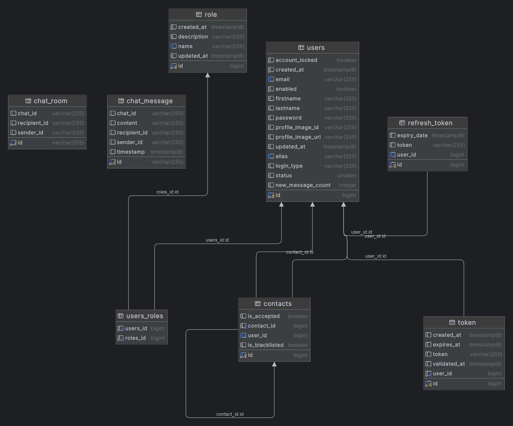
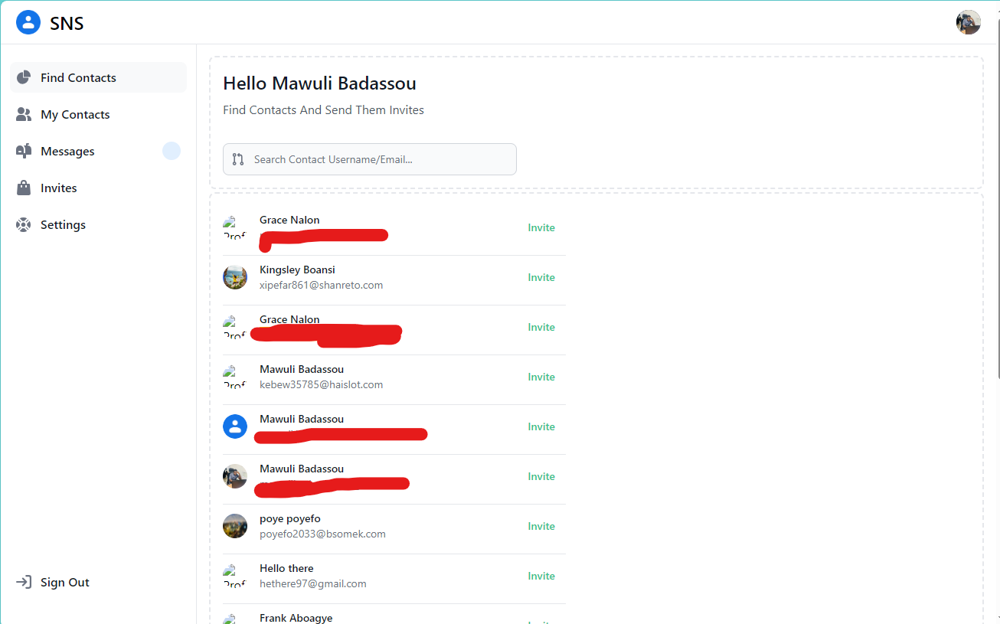

# Social Networking Site (Java)

## Project Brief

Social networking has become an integral part of modern communication and socialization. This project aims to address issues such as cyberbullying, privacy concerns, and fake accounts by prioritizing user privacy and safety.

## Project Structure

- **Frontend**: Hosted on [Vercel](https://social-networking-site-blue.vercel.app/). Built with Angular.
- **Backend**: Built with Spring Boot (Java).

## Deployment

Fork the Repo

### Frontend
- Pull from frontend-dev branch

- Ensure Node and Angular CLI is installed, then run:
- ng serve

### Backend
- Pull from backend-dev

- Ensure Java SDK is installed. Run the application after pulling from the repository. (IntelliJ IDE is recommended)

## Entity Relation Diagram

## Functionalities

- **User Registration**: Users can register to gain access to the platform.
- **User Login**: Users must log in to the system before performing any action.
- **Profile Management**: Users have a settings page to manage their profile and ensure their safety on the platform.
- **Connect with Other Users**: Users can connect with other platform users, allowing them to become friends and appear in the user's contact list.
- **Content Sharing**: Users can share content with their contacts to promote a good experience.
- **Real-Time Messaging**: Users can send and receive messages in real-time to communicate effectively with their friends.
- **Manage Friends**: Users can add or remove friends from their contact list to manage their social connections.
- **Update Contact Information and Password**: Users can update their contact information and change their password to keep their account secure.
- **View Friend List and Profiles**: Users can view their friend list and other people's profiles to stay connected.
- **View Last Messages**: Users can view the last messages in their conversations to keep track of their chats.
- **Profile Images or Avatars**: Users can have a profile image or avatar to personalize their account.
- **Search for Other Users**: Users can search for other users to connect with them.

## Technologies Used

### Frontend:
- Angular: Used for building the user interface.
- Flowbite: A utility-first CSS framework used for building the UI components.
- Apollo Client: Used for making GraphQL queries.
- SockJS: Used for handling socket connections.
- Tailwind CSS: A utility-first CSS framework for rapidly building custom user interfaces.

### Backend:
- Spring Boot: Used for creating stand-alone, production-grade Spring based applications.
- PostgreSQL: Used as the relational database for storing data.
- Flyway: Used for version control for the database.
- OAuth: Used for authorization protocol.
- Cloudinary: Used for image hosting.

### Testing:
- JUnit: Used for unit testing of the application.
- Mockito: Used for mocking objects in unit tests.

### Others:
- Maven: Used for managing project's build.

## Swagger Support

The application includes support for Swagger. You can use the Swagger-UI endpoint to get a server-side API description.

## Social Sign-In Feature

The application supports sign-in with Google and Facebook. To enable this feature, you need to register your application with Google and Facebook, and then set the application's credentials in the `application-dev.properties` file.

You can register your application and get the application IDs and secrets from the following links:

- Google: [https://developers.google.com/+/web/signin/server-side-flow#step_1_create_a_client_id_and_client_secret](https://developers.google.com/+/web/signin/server-side-flow#step_1_create_a_client_id_and_client_secret)
- Facebook: [https://developers.facebook.com/docs/facebook-login/v2.2](https://developers.facebook.com/docs/facebook-login/v2.2)
- GitHub: [https://github.com/settings/developers](https://github.com/settings/developers)

## Cloudinary Support

The application uses Cloudinary for image and video hosting. To set up Cloudinary, you need to create an account and get your Cloudinary credentials. Then, set these credentials in the `application-dev.properties` file.

You can get your Cloudinary credentials from the following link:

- Cloudinary: [https://console.cloudinary.com](https://console.cloudinary.com)

## Screenshots

### Sign In

### Sign Up

### Find Contacts

### My Contacts

### Chat

### Settings

## License

This project is licensed under the MIT License - see the [LICENSE.md](https://github.com/MawuliB/Social-Networking-Site/blob/frontend-prod/LICENSE.md) file for details